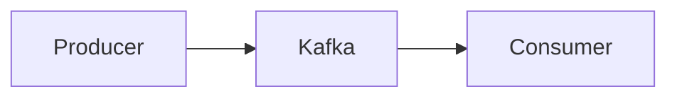
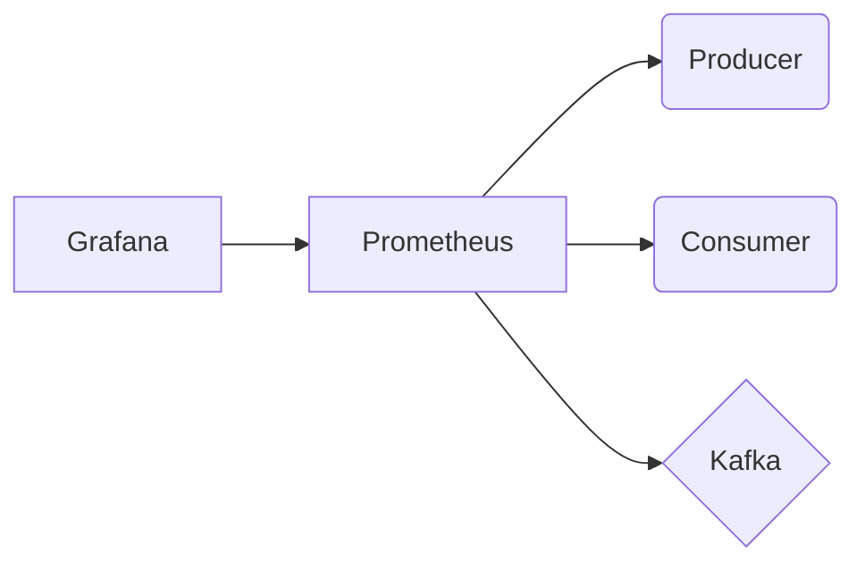

# Kafka Consumer and Producer on Kubernetes

In This projesct im going to implement this basic Design

And on top of that a Promethoues and grafna monitoring on this components

## Prerequisits

This project was created, ran and tested on MacOs Cataline (10.15)
in order to run the deploy script you should install -
Home brew -`bash curl -fsSL https://raw.githubusercontent.com/Homebrew/install/HEAD/install.sh`
Docker - `brew cask install docker`
Kind - `brew install kind`
Helm - `brew install helm`

## Deploying the stack
